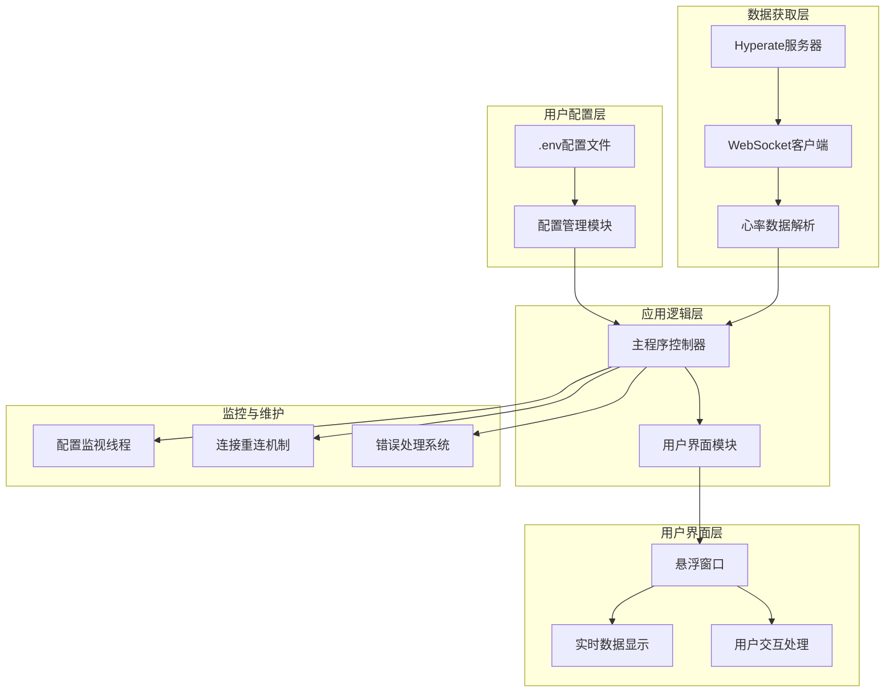

# Hyperate Overlay

[](https://www.python.org/downloads/)
[](LICENSE)
[](https://www.microsoft.com/windows)

一个专业的实时心率监控悬浮窗应用，支持从Hyperate平台获取并显示当前心率、最高心率和最低心率数据。

## 功能特性

### 核心功能

- **实时三值显示**: 同时展示当前心率、历史最高心率和最低心率
- **置顶悬浮窗口**: 始终显示在最顶层，不被其他应用程序遮挡
- **拖拽定位**: 支持鼠标拖拽自由调整窗口位置
- **阈值提醒**: 心率超过设定阈值时自动闪烁提醒

### 技术特性

- **智能数据获取**: 自动从Hyperate网页提取WebSocket连接信息
- **动态配置重载**: 支持运行时修改配置，无需重启应用
- **自动重连机制**: WebSocket连接断开时自动尝试重连
- **高度可定制**: 完整的颜色、字体、透明度、位置自定义选项
- **视觉优化**: 字体抗锯齿、阴影效果、透明背景支持

## 快速开始

### 系统要求

- **操作系统**: Windows 10/11
- **Python**: 3.14 或更高版本
- **网络**: 稳定的互联网连接

### 安装步骤

1. **克隆仓库**

   ```bash
   git clone https://github.com/CooperZhuang/hyperate-overlay.git
   cd hyperate-overlay
   ```

2. **安装依赖**

   ```bash
   # 使用uv（推荐）
   uv sync
   ```

3. **配置应用**

   ```bash
   # 复制配置文件模板
   cp .env.example .env
   
   # 编辑配置文件
   notepad .env
   ```

   在`.env`文件中，将`YOUR_ID_HERE`替换为你的真实Hyperate会话ID。

4. **运行应用**

   ```bash
   python main.py
   ```

## 配置说明

### 必需配置

| 配置项         | 描述             | 示例值                                                          |
| -------------- | ---------------- | --------------------------------------------------------------- |
| `HYPERATE_URL` | Hyperate会话链接 | `https://www.hyperate.io/pulse-dynamics-ecg?id=YOUR_SESSION_ID` |

### 显示配置

| 配置项          | 描述             | 默认值    | 范围           |
| --------------- | ---------------- | --------- | -------------- |
| `CURRENT_SIZE`  | 当前心率字体大小 | 96        | 24-200         |
| `CURRENT_COLOR` | 当前心率颜色     | `#FF2D00` | 十六进制颜色码 |
| `MAX_COLOR`     | 最高心率颜色     | `#FF6B6B` | 十六进制颜色码 |
| `MIN_COLOR`     | 最低心率颜色     | `#4ECDC4` | 十六进制颜色码 |
| `BPM_COLOR`     | "BPM"文字颜色    | `#FFFFFF` | 十六进制颜色码 |

### 布局配置

| 配置项           | 描述       | 默认值 | 说明          |
| ---------------- | ---------- | ------ | ------------- |
| `BG_TRANSPARENT` | 背景透明   | `true` | true/false    |
| `OPACITY`        | 窗口透明度 | 0.85   | 0.1-1.0       |
| `POS_X`          | 窗口X坐标  | 50     | 像素值        |
| `POS_Y`          | 窗口Y坐标  | 30     | 像素值        |
| `ROW_SPACING`    | 行间距     | 0      | 0表示默认间距 |

### 功能配置

| 配置项            | 描述         | 默认值 | 说明               |
| ----------------- | ------------ | ------ | ------------------ |
| `BLINK_ENABLE`    | 启用闪烁提醒 | `true` | true/false         |
| `BLINK_THRESHOLD` | 闪烁阈值     | 160    | 心率超过此值时闪烁 |
| `UPDATE_INTERVAL` | 数据更新间隔 | 3      | 单位：秒           |

### 高级配置

| 配置项                 | 描述              | 默认值 | 说明           |
| ---------------------- | ----------------- | ------ | -------------- |
| `BACKUP_WEBSOCKET_KEY` | 备用WebSocket密钥 | 空     | 仅用于故障排除 |

## 使用方法

### 基本操作

1. **启动应用**: 运行`python main.py`
2. **窗口移动**: 鼠标左键拖拽窗口到任意位置
3. **退出应用**: 右键点击窗口或使用快捷键 Ctrl+C

### 数据显示

- **大字体**: 当前实时心率
- **右上角小字体**: 最高心率记录
- **右下角小字体**: 最低心率记录

### 高级功能

- **动态配置重载**: 修改`.env`文件后，应用会在2秒内自动重新加载配置
- **闪烁提醒**: 当心率超过设定阈值时，窗口会自动闪烁提醒
- **位置记忆**: 拖拽窗口后，新位置会自动保存到配置文件

## 获取Hyperate URL

根据Hyperate APP界面提示获取

## 技术架构

### 系统架构图



### 模块说明

#### 1. 主程序模块 (`main.py`)

- **职责**: 应用入口点，协调各模块工作
- **功能**:
  - 初始化配置、WebSocket连接和用户界面
  - 启动配置监视线程
  - 处理应用生命周期和错误恢复

#### 2. 配置管理模块 (`config.py`)

- **职责**: 环境变量管理和配置监控
- **功能**:
  - 从`.env`文件加载配置
  - 监控配置文件变化并动态重载
  - 配置验证和默认值处理
  - 提供配置访问接口

#### 3. WebSocket客户端模块 (`websocket_client.py`)

- **职责**: 与Hyperate服务器通信
- **功能**:
  - 自动从Hyperate网页提取连接信息
  - 建立和维护WebSocket连接
  - 解析心率数据并传递给UI模块
  - 实现连接断开自动重连

#### 4. 用户界面模块 (`ui.py`)

- **职责**: 图形界面显示和用户交互
- **功能**:
  - 创建透明悬浮窗口
  - 实时显示心率数据
  - 处理鼠标拖拽事件
  - 实现闪烁提醒效果
  - 支持窗口置顶显示

### 数据流

1. **配置加载**: `.env` → `config.py` → 各模块
2. **数据获取**: Hyperate服务器 → WebSocket → 数据解析 → UI更新
3. **用户交互**: 鼠标事件 → UI处理 → 配置更新 → 实时生效
4. **监控维护**: 配置文件监控 + 连接状态监控 → 自动恢复

## 开发指南

### 环境设置

```bash
# 克隆项目
git clone https://github.com/CooperZhuang/hyperate-overlay.git
cd hyperate-overlay

# 安装开发依赖
uv sync

# 创建开发配置
cp .env.example .env
```

### 依赖管理

项目使用`uv`进行现代化的Python依赖管理：

```bash
# 安装依赖
uv sync

# 添加新依赖
uv add package_name

# 更新依赖
uv sync --upgrade

# 查看依赖树
uv tree
```

### 代码规范

- 遵循PEP 8代码规范
- 使用类型注解
- 编写完整的文档字符串
- 保持模块化设计

### 测试运行

```bash
# 运行主程序
python main.py
```

## 故障排除

### 常见问题

#### Q1: 无法连接到Hyperate服务器

**解决方案**:

1. 确认`HYPERATE_URL`配置正确
2. 检查网络连接
3. 确认Hyperate账户有活跃会话
4. 尝试手动设置`BACKUP_WEBSOCKET_KEY`

#### Q2: 窗口显示异常

**解决方案**:

1. 检查WebSocket连接状态
2. 确认`BG_TRANSPARENT`设置
3. 验证颜色配置格式
4. 更新显卡驱动程序

#### Q3: 配置修改不生效

**解决方案**:

1. 确认`.env`文件语法正确
2. 等待2秒让应用自动重载
3. 重启应用程序

#### Q4: 心率数据停止更新

**解决方案**:

1. 应用会自动重连，等待1-2分钟
2. 重启应用程序
3. 确认Hyperate页面仍显示实时数据

### 日志分析

运行应用时查看控制台输出，常见日志信息：

- "环境变量已重新加载": 配置更新成功
- "WebSocket连接失败": 网络连接问题
- "无法解析心率数据": 数据格式变化，需更新解析逻辑

### 性能优化

- 增大`UPDATE_INTERVAL`值减少CPU占用
- 关闭闪烁功能(`BLINK_ENABLE=false`)
- 定期重启应用释放内存
- 使用有线网络连接提升稳定性

## 贡献指南

我们欢迎各种形式的贡献，包括bug报告、功能建议、代码改进和文档完善。

### 贡献流程

1. Fork本仓库
2. 创建功能分支 (`git checkout -b feature/your-feature`)
3. 提交更改 (`git commit -m 'Add some feature'`)
4. 推送到分支 (`git push origin feature/your-feature`)
5. 创建Pull Request

### 代码要求

- 遵循现有代码风格和规范
- 更新相关文档
- 确保向后兼容性

### 报告问题

在GitHub Issues中报告问题时，请提供：

- 详细的问题描述
- 重现步骤
- 环境信息（系统版本、Python版本等）
- 相关日志和截图

## 许可证

本项目采用 GNU General Public License v3.0 (GPL-3.0) 开源协议。

### 允许事项

- 商业使用
- 修改代码
- 分发代码
- 私人使用

### 要求事项

- 包含原始许可证和版权声明
- 包含修改说明（如适用）
- 如果分发修改后的版本，必须开源修改后的代码
- 必须保留相同的许可证

### 免责声明

本软件按"原样"提供，不提供任何明示或暗示的保证，包括但不限于适销性和特定用途适用性的保证。

有关完整的许可证条款，请参阅 [LICENSE](LICENSE) 文件。

## 支持与联系

- **问题反馈**: [GitHub Issues](https://github.com/CooperZhuang/hyperate-overlay/issues)
- **讨论交流**: [GitHub Discussions](https://github.com/CooperZhuang/hyperate-overlay/discussions)
- **项目主页**: [GitHub Repository](https://github.com/CooperZhuang/hyperate-overlay)

## 致谢

感谢以下开源项目和社区的支持：

- Python社区提供的强大生态
- uv项目提供的现代化包管理工具
- WebSocket协议实现的实时数据传输
- 所有贡献者的反馈和改进建议

---

如果这个项目对您有帮助，请考虑给我们一个⭐Star！
