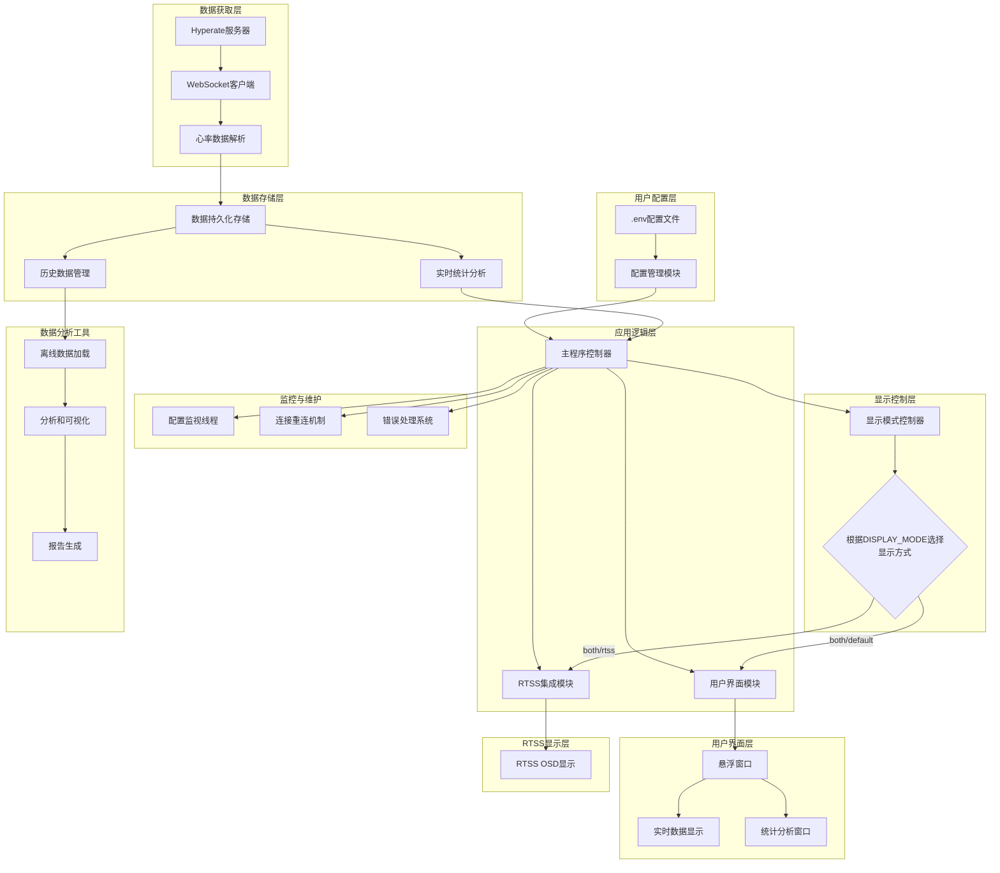

# Hyperate Overlay

[](https://www.python.org/downloads/)
[](LICENSE)
[](https://www.microsoft.com/windows)

专业的实时心率监控悬浮窗应用，从 [Hyperate](https://www.hyperate.io/) 平台获取并实时显示心率数据。

## 功能特性

- **实时心率监控**：同时显示当前心率、历史最高和最低心率
- **心率统计分析**：完整的统计信息展示，包括平均心率、标准差、心率区间分布、趋势分析
- **数据持久化**：自动保存历史心率数据，按日期自动创建CSV文件，支持长期数据保留
- **数据导出功能**：支持导出为CSV、JSON、TXT格式的数据文件，可按时间范围过滤
- **置顶悬浮窗口**：窗口始终置顶显示，不被其他应用遮挡
- **拖拽定位**：支持鼠标拖拽调整窗口位置
- **阈值提醒**：心率超过设定阈值时自动闪烁提醒
- **RTSS OSD 集成**：支持在 RTSS（RivaTuner Statistics Server）中显示心率数据，适用于全屏游戏
- **智能数据获取**：自动从 Hyperate 网页提取 WebSocket 连接信息
- **动态配置重载**：支持运行时修改配置，无需重启应用

## 快速开始

### 系统要求

- **操作系统**：Windows 10/11
- **Python**：3.14 或更高版本
- **网络**：稳定的互联网连接

### 安装步骤

1. **克隆仓库**

   ```bash
   git clone https://github.com/CooperZhuang/hyperate-overlay.git
   cd hyperate-overlay
   ```

2. **安装依赖**

   ```bash
   # 使用 uv（推荐）
   uv sync
   ```

3. **配置应用**

   ```bash
   # 复制配置文件模板
   cp .env.example .env
   
   # 编辑配置文件
   notepad .env
   ```

   在 `.env` 文件中，将 `YOUR_ID_HERE` 替换为你的真实 Hyperate 会话 ID。

### 获取 Hyperate 会话

1. 访问 [Hyperate 官网](https://www.hyperate.io/)了解相关APP安装与使用
2. 在APP中获取实时心率监控会话链接
3. 将链接中的会话 ID 复制到配置文件中
4. **运行应用**

   ```bash
   python main.py
   ```

## 配置

### 必需配置

| 配置项         | 描述              | 示例值                                                          |
| -------------- | ----------------- | --------------------------------------------------------------- |
| `HYPERATE_URL` | Hyperate 会话链接 | `https://www.hyperate.io/pulse-dynamics-ecg?id=YOUR_SESSION_ID` |

### 显示配置

| 配置项           | 描述             | 默认值    |
| ---------------- | ---------------- | --------- |
| `CURRENT_SIZE`   | 当前心率字体大小 | 96        |
| `CURRENT_COLOR`  | 当前心率颜色     | `#FF2D00` |
| `MAX_COLOR`      | 最高心率颜色     | `#FF6B6B` |
| `MIN_COLOR`      | 最低心率颜色     | `#4ECDC4` |
| `BG_TRANSPARENT` | 背景透明         | `true`    |
| `OPACITY`        | 窗口透明度       | 0.85      |

### RTSS 集成

| 配置项                | 描述     | 默认值                        |
| --------------------- | -------- | ----------------------------- |
| `DISPLAY_MODE`        | 显示模式 | `both`                        |
| `RTSS_DISPLAY_FORMAT` | 显示格式 | `BPM {current} ({max}/{min})` |

完整配置选项请参考 [.env.example](.env.example) 文件。

## 使用方法

### 基本操作

- **启动应用**：运行 `python main.py`
- **窗口移动**：鼠标左键拖拽窗口到任意位置
- **退出应用**：右键点击窗口或使用快捷键 Ctrl+C

### 数据显示

- **大字体**：当前实时心率
- **右上角小字体**：最高心率记录
- **右下角小字体**：最低心率记录

### 心率统计分析

1. 右键点击悬浮窗口弹出菜单，选择"统计分析 (F12)"或直接按F12键
2. 在统计分析窗口中查看实时更新的心率数据统计信息
3. 使用时间范围选择器查看不同时间段的统计数据：
   - 全部：显示自应用启动以来的所有数据
   - 最近5分钟：最近5分钟的统计信息
   - 最近15分钟：最近15分钟的统计信息
   - 最近30分钟：最近30分钟的统计信息
   - 最近1小时：最近1小时的统计信息

#### 统计信息说明

- **数据点数量**：记录的总心率数据点数
- **持续时间**：数据收集的总时长
- **心率范围**：最低、最高、平均、中位心率值和标准差
- **心率区间统计**：不同心率范围的数据分布
- **心率趋势**：基于最近数据的变化趋势分析

### 数据导出

1. 在统计分析窗口中点击"导出数据"按钮
2. 选择保存位置和文件格式（CSV、JSON或TXT）
3. 导出的数据将按选中的时间范围进行过滤

### RTSS 使用

1. 在 `.env` 文件中设置 `DISPLAY_MODE=rtss` 或 `DISPLAY_MODE=both`
2. 确保 RTSS（RivaTuner Statistics Server）已安装并运行
3. 自定义显示格式：修改 `RTSS_DISPLAY_FORMAT` 配置项
4. 显示模式说明：
   - `both`: 同时显示悬浮窗口和 RTSS OSD
   - `rtss`: 仅显示 RTSS OSD（适用于全屏游戏）
   - `default`: 仅显示悬浮窗口

### 离线心率数据分析工具

除了实时监控，您还可以使用独立的心率数据分析工具对历史数据进行深入分析：

```bash
# 分析单个CSV文件
python heart_rate_analyzer.py heart_rate_data/heart_rate_2025-12-06.csv

# 分析整个数据目录的多天数据
python heart_rate_analyzer.py heart_rate_data/ --days 7

# 自定义输出目录，不生成图表
python heart_rate_analyzer.py heart_rate_data/heart_rate_2025-12-06.csv --output analysis_output --no-plots
```

#### 分析工具功能

- **数据加载**：自动检测有/无头部格式，支持多天数据合并
- **综合统计**：平均心率、标准差、变异系数、RMSSD等高级指标
- **心率区间分析**：极低/偏低/正常/偏高/过高五个区间的分布统计
- **趋势可视化**：心率趋势图、分布直方图、移动平均线分析
- **区间分析图**：饼图和条形图展示心率区间分布
- **分析报告**：生成详细的TXT格式分析报告

#### 输出文件说明

- `analysis_report.txt`: 详细的心率数据分析报告
- `heart_rate_trend.png`: 心率趋势图表（需要matplotlib）
- `heart_rate_zones.png`: 心率区间分析图表

## 技术架构



### 模块说明

- **主程序模块** (`main.py`)：应用入口点，协调各模块工作
- **配置管理模块** (`config.py`)：环境变量管理和配置监控，支持动态重载
- **WebSocket客户端模块** (`websocket_client.py`)：与Hyperate服务器通信，自动提取websocketKey
- **用户界面模块** (`ui.py`)：图形界面显示和用户交互，支持统计分析窗口
- **RTSS集成模块** (`rtss_integration.py`)：RTSS OSD显示支持，使用Saku RTSS CLI.dll
- **统计分析模块** (`stats_analyzer.py`)：心率数据统计分析和持久化存储
- **离线分析工具** (`heart_rate_analyzer.py`)：独立的心率数据分析工具，支持图表生成和报告输出
- **发布自动化脚本** (`release.py`)：自动化版本管理、依赖同步和发布流程

## 许可证

本项目采用 **GNU General Public License v3.0 (GPL-3.0)** 开源协议。

### 协议说明

- 本项目选择使用 GPL-3.0 协议发布
- 项目使用了来自 [RTSS-CLI](https://github.com/Erruar/RTSS-CLI) 项目的 `Saku RTSS CLI.dll` 文件，该 DLL 同样遵循 GPL-3.0 协议
- 两个 GPL-3.0 协议的组件完全兼容

### 允许事项

- 商业使用
- 修改代码
- 分发代码
- 私人使用

### 要求事项

- 包含原始许可证和版权声明
- 包含修改说明（如适用）
- 如果分发修改后的版本，必须开源修改后的代码
- 必须保留相同的许可证（GPL-3.0）
- 必须注明使用了 RTSS-CLI 项目的 DLL

有关完整的许可证条款，请参阅 [LICENSE](LICENSE) 文件。

## 支持与贡献

- **问题反馈**：[GitHub Issues](https://github.com/CooperZhuang/hyperate-overlay/issues)
- **讨论交流**：[GitHub Discussions](https://github.com/CooperZhuang/hyperate-overlay/discussions)
- **项目主页**：[GitHub Repository](https://github.com/CooperZhuang/hyperate-overlay)

欢迎提交 Issue 或 Pull Request 来改进本项目！

---

如果这个项目对您有帮助，请考虑给我们一个 Star！
