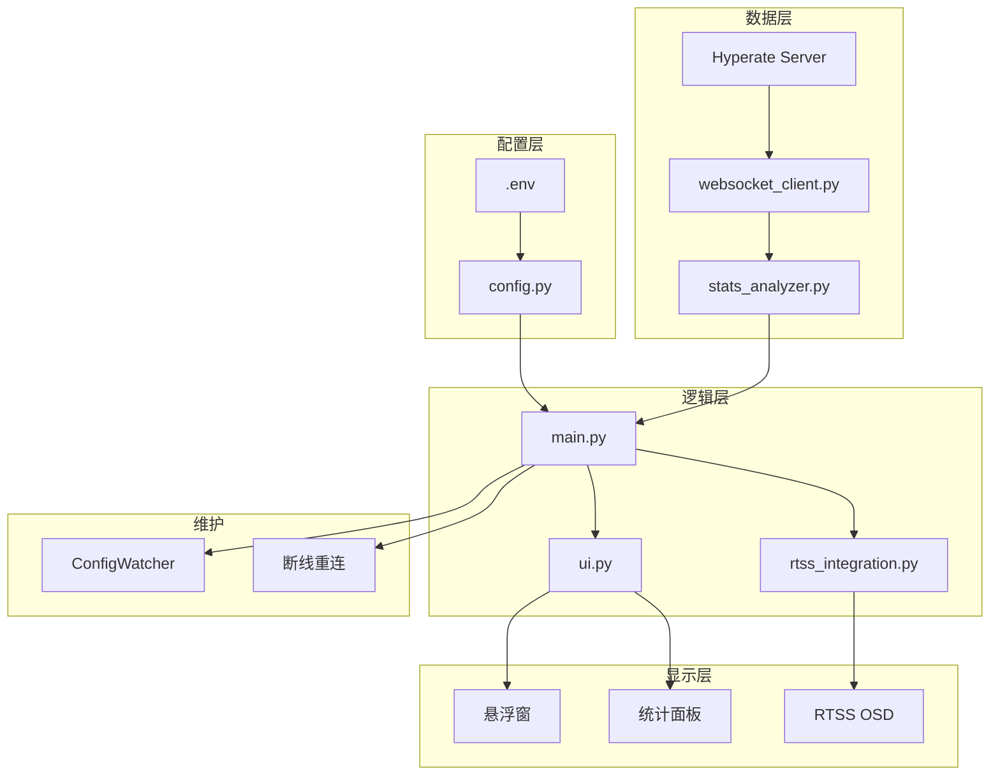

# Hyperate Overlay

[](https://www.python.org/downloads/)
[](LICENSE)


实时心率监控悬浮窗，通过 [Hyperate](https://www.hyperate.io/) 平台的 WebSocket 接口获取并显示心率数据。支持 RTSS OSD 集成，适用于全屏游戏场景。

## 功能

- **三值显示**：当前心率、历史最高、历史最低，同时呈现在悬浮窗中
- **数据持久化**：按日期自动生成 CSV 日志，数据长期保留
- **心率统计**：实时统计面板（F12），含均值、标准差、中位数、区间分布及趋势分析
- **数据导出**：支持 CSV / JSON / TXT 三种格式，可按时间范围过滤
- **阈值闪烁**：心率超过阈值时窗口闪烁提醒
- **窗口置顶**：悬浮窗始终置顶，支持鼠标拖拽定位
- **RTSS OSD**：通过 RivaTuner Statistics Server 在游戏中叠加显示心率数据
- **自动获取 WebSocket Key**：从 Hyperate 页面提取连接参数，无需手动抓包
- **配置热加载**：修改 `.env` 后自动生效，无需重启

## 快速开始

### 环境要求

- **操作系统**：Windows 10+ / macOS / Linux（RTSS 集成仅支持 Windows）
- **Python**：3.14+
- **网络**：稳定的互联网连接

### 安装

```bash
git clone https://github.com/CooperZhuang/hyperate-overlay.git
cd hyperate-overlay

# 安装依赖（推荐使用 uv）
uv sync
```

### 配置

```bash
cp .env.example .env
```

编辑 `.env`，将 `HYPERATE_URL` 中的 `YOUR_ID_HERE` 替换为你的实际会话 ID。

### 获取 Hyperate 会话 ID

1. 在手机或可穿戴设备上安装 Hyperate 配套 App，完成心率源绑定
2. 在 App 中生成实时心率分享链接
3. 从链接中提取 `id` 参数，填入 `.env` 的 `HYPERATE_URL`

### 启动

```bash
# 直接运行入口文件
python main.py

# 或使用 uv
uv run main.py
```

## 配置参考

### 必需配置

| 配置项 | 描述 | 示例 |
| --- | --- | --- |
| `HYPERATE_URL` | Hyperate 会话链接 | `https://www.hyperate.io/pulse-dynamics-ecg?id=<SESSION_ID>` |

### 显示配置

| 配置项 | 描述 | 默认值 |
| --- | --- | --- |
| `CURRENT_SIZE` | 当前心率字号 | `96` |
| `CURRENT_COLOR` | 当前心率颜色 | `#FF2D00` |
| `MAX_COLOR` | 最高心率颜色 | `#FF6B6B` |
| `MIN_COLOR` | 最低心率颜色 | `#4ECDC4` |
| `BPM_COLOR` | BPM 标签颜色 | `#FFFFFF` |
| `BG_TRANSPARENT` | 窗口背景透明 | `true` |
| `OPACITY` | 窗口不透明度（0–1） | `0.85` |
| `POS_X` | 窗口初始 X 坐标 | `50` |
| `POS_Y` | 窗口初始 Y 坐标 | `30` |

### 阈值提醒

| 配置项 | 描述 | 默认值 |
| --- | --- | --- |
| `BLINK_ENABLE` | 启用闪烁提醒 | `true` |
| `BLINK_THRESHOLD` | 触发闪烁的心率阈值 | `160` |
| `ROW_SPACING` | 行间距 | `0` |

### 数据更新

| 配置项 | 描述 | 默认值 |
| --- | --- | --- |
| `UPDATE_INTERVAL` | UI 刷新间隔（秒） | `3` |

### RTSS 集成

| 配置项 | 描述 | 默认值 |
| --- | --- | --- |
| `DISPLAY_MODE` | 显示模式：`both` / `default` / `rtss` | `both` |
| `RTSS_DISPLAY_FORMAT` | RTSS 显示格式，可用变量 `{current}` `{max}` `{min}` | `BPM {current} ({max}/{min})` |
| `RTSS_UPDATE_INTERVAL` | RTSS 刷新间隔（秒） | `1` |

完整选项见 [.env.example](.env.example)。

## 使用说明

### 基本操作

- **移动窗口**：鼠标左键拖拽
- **右键菜单**：右键点击窗口弹出上下文菜单
- **统计分析**：右键菜单选择"统计分析 (F12)"，或直接按 F12
- **退出**：右键菜单选择退出，或终端 `Ctrl+C`

### 数据显示

| 位置 | 内容 |
| --- | --- |
| 中央大字 | 当前实时心率 |
| 右上小字 | 历史最高心率 |
| 右下小字 | 历史最低心率 |

### 统计分析面板

统计面板提供以下指标：

- **数据概览**：记录数、持续时长
- **心率范围**：最低、最高、均值、中位数、标准差
- **区间分布**：各心率区间（极低 / 偏低 / 正常 / 偏高 / 过高）的数据占比
- **趋势分析**：基于近期数据的滑动平均趋势

面板顶部提供时间范围筛选：全部 / 最近 5 分钟 / 15 分钟 / 30 分钟 / 1 小时。

### 数据导出

1. 统计分析面板中点击"导出数据"
2. 选择保存路径及格式（CSV / JSON / TXT）
3. 导出范围与面板当前选择的时间范围一致

### RTSS OSD

1. 安装并启动 [RTSS](https://www.guru3d.com/download/rtss-rivatuner-statistics-server-download/)（RivaTuner Statistics Server）
2. 在 `.env` 中设置显示模式：
   - `both` — 悬浮窗 + RTSS OSD 同时显示
   - `rtss` — 仅 RTSS OSD，适合全屏游戏
   - `default` — 仅悬浮窗
3. 可选：修改 `RTSS_DISPLAY_FORMAT` 自定义 OSD 显示内容

### 离线数据分析

[heart_rate_analyzer.py](heart_rate_analyzer.py) 是一个独立的 CLI 工具，可对历史 CSV 数据进行统计分析和可视化：

```bash
# 分析单个 CSV 文件
python heart_rate_analyzer.py heart_rate_data/heart_rate_2025-12-06.csv

# 合并分析多天数据
python heart_rate_analyzer.py heart_rate_data/ --days 7

# 指定输出目录，跳过图表生成
python heart_rate_analyzer.py heart_rate_data/heart_rate_2025-12-06.csv --output analysis_output --no-plots
```

生成文件：

| 文件 | 说明 |
| --- | --- |
| `analysis_report.txt` | 详细统计报告 |
| `heart_rate_trend.png` | 心率趋势图（需 matplotlib） |
| `heart_rate_zones.png` | 心率区间分布图（需 matplotlib） |

分析指标包括：均值、标准差、变异系数、RMSSD、五区间分布、滑动平均趋势等。

## 技术架构


```mermaid
graph TB
    subgraph "配置层"
        A[.env] --> B[config.py]
    end

    subgraph "数据层"
        C[Hyperate Server] --> D[websocket_client.py]
        D --> E[stats_analyzer.py]
    end

    subgraph "逻辑层"
        B --> F[main.py]
        E --> F
        F --> G[ui.py]
        F --> H[rtss_integration.py]
    end

    subgraph "显示层"
        G --> I[悬浮窗]
        G --> J[统计面板]
        H --> K[RTSS OSD]
    end

    subgraph "维护"
        L[ConfigWatcher]
        M[断线重连]
    end

    F --> L
    F --> M
```

### 模块

| 文件 | 职责 |
| --- | --- |
| [main.py](main.py) | 应用入口，协调各模块生命周期 |
| [config.py](config.py) | 环境变量加载、配置模型、`.env` 变更监听 |
| [websocket_client.py](websocket_client.py) | WebSocket 连接管理，自动提取 `websocketKey`，处理重连 |
| [ui.py](ui.py) | Tkinter 悬浮窗、统计面板、右键菜单 |
| [stats_analyzer.py](stats_analyzer.py) | 心率数据统计与 CSV 持久化 |
| [rtss_integration.py](rtss_integration.py) | RTSS OSD 集成，通过 ctypes 加载 Saku RTSS CLI.dll |
| [heart_rate_analyzer.py](heart_rate_analyzer.py) | 离线数据分析 CLI 工具（pandas + matplotlib） |
| [release.py](release.py) | 本地发布脚本，版本号管理、依赖同步、触发 CI |

## 许可证

本项目以 [GNU General Public License v3.0](LICENSE) 发布。

项目使用了 [RTSS-CLI](https://github.com/Erruar/RTSS-CLI) 的 `Saku RTSS CLI.dll`，该 DLL 同样以 GPL-3.0 发布，二者协议兼容。

- **允许**：商业使用、代码修改、分发、私人使用
- **要求**：保留原始许可证与版权声明，分发修改版本时须以 GPL-3.0 开源

## 反馈

- [GitHub Issues](https://github.com/CooperZhuang/hyperate-overlay/issues)
- [GitHub Discussions](https://github.com/CooperZhuang/hyperate-overlay/discussions)
